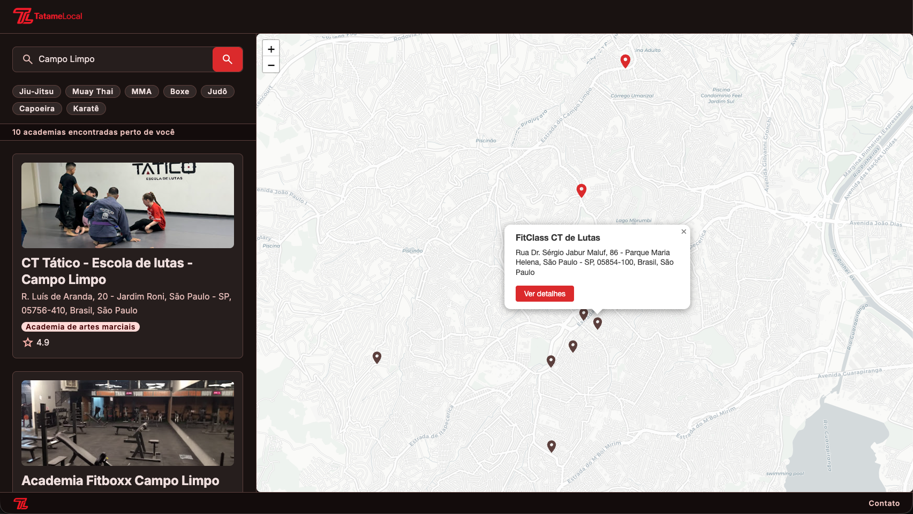
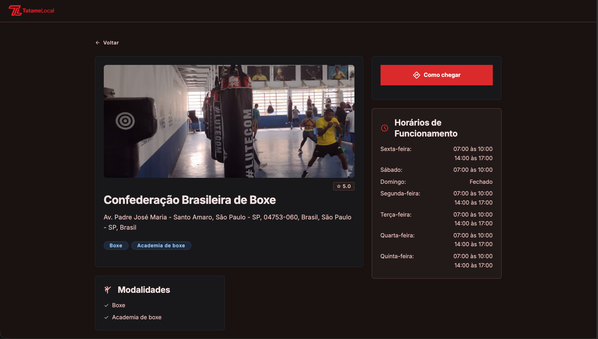

# TatameLocal

> Encontre academias de artes marciais perto de você.


**[Ver projeto ao vivo →](https://tatamelocal.vercel.app)**

> ⚠️ **Projeto em desenvolvimento ativo** — o banco de dados está sendo populado continuamente. Novas academias são adicionadas regularmente.

---

## Sobre o projeto

TatameLocal nasceu de uma necessidade real: como praticante de artes marciais, recebia constantemente a pergunta "onde posso treinar perto de mim?". Não encontrei plataforma focada nisso — então construí uma.

O projeto vai além do front-end. Tem uma pipeline de coleta de dados automatizada com n8n e Apify que busca academias reais no Google Maps, normaliza os dados e popula o banco automaticamente — sem inserção manual.



## Funcionalidades

- Busca por cidade, bairro ou região
- Geolocalização automática pelo browser
- Filtro por modalidade (Jiu-Jitsu, Muay Thai, MMA, Boxe, Judô, Capoeira, Karatê)
- Mapa interativo com pins por academia
- Separação visual entre academias na localidade buscada e academias próximas
- Página de detalhes com endereço, telefone, WhatsApp, horários e avaliação
- Pipeline de coleta automatizada via n8n + Apify



## Stack

**Front-end**
- Vue 3 + Composition API + TypeScript
- Tailwind CSS (tema customizado dark mode)
- Leaflet + OpenStreetMap
- Nominatim (geocodificação)

**Back-end**
- Supabase (PostgreSQL + RPC functions)

**Automação e coleta de dados**
- n8n self-hosted
- Apify (Google Maps Extractor)

**Deploy**
- Vercel (front-end)

## Como funciona a coleta de dados

Um workflow no n8n busca academias de artes marciais via Apify (que usa o Google Maps como fonte), normaliza os dados, deduplica por `place_id` e insere ou atualiza no Supabase automaticamente.

```
n8n → Apify (Google Maps) → Normalização → Deduplicação → Supabase
```

## Roadmap

- [ ] Aumentar cobertura de cidades
- [ ] Página de cadastro para academias
- [ ] Avaliações de usuários


## Autor

Feito por **Anderson** — [LinkedIn](https://www.linkedin.com/in/andersonromao)

---

*Desenvolvido com auxílio de ferramentas de IA.*